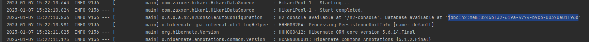
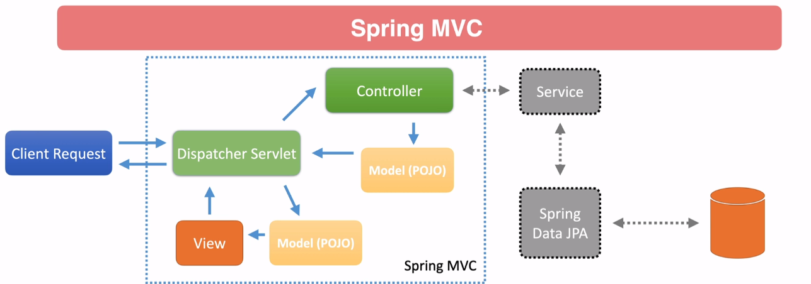

<h3>H2 console</h3> 
 in memory database
Check the app log when it starts for the JDBC URL

<h3>Spring MVC</h3>

<h3>Spring Controllers</h3>

<h3>Other Sources</h3>
https://github.com/spring-petclinic