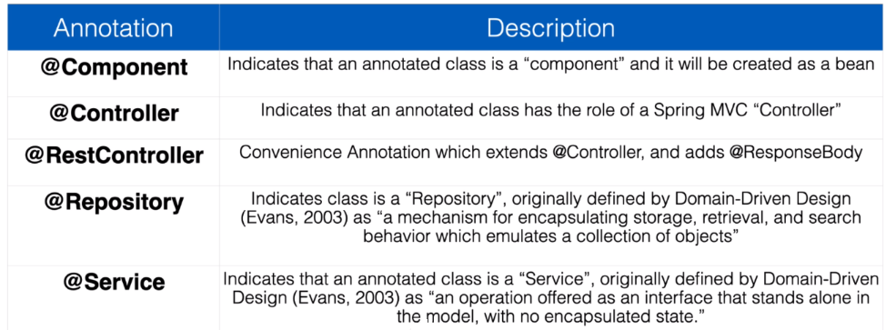
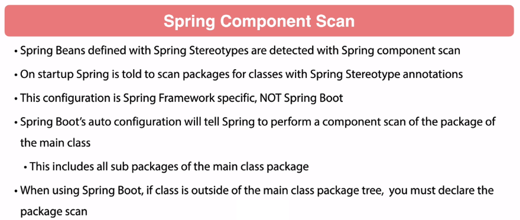

### H2 console 
 in memory database
Check the app log when it starts for the JDBC URL

### Spring MVC 

### Spring Controllers 

### Other Sources
https://github.com/spring-petclinic

### Spring Stereotypes

### Spring Component Scan

